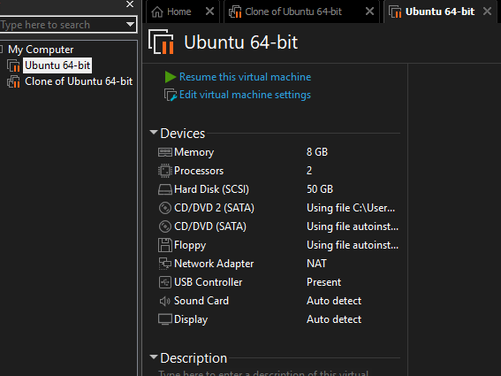
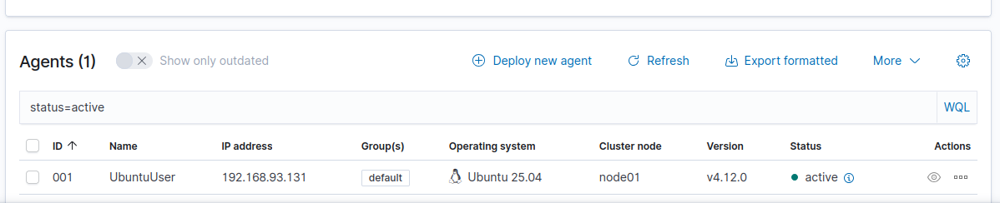
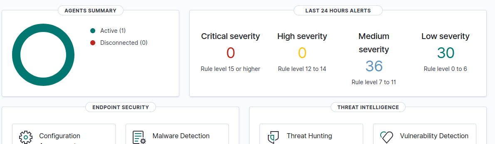
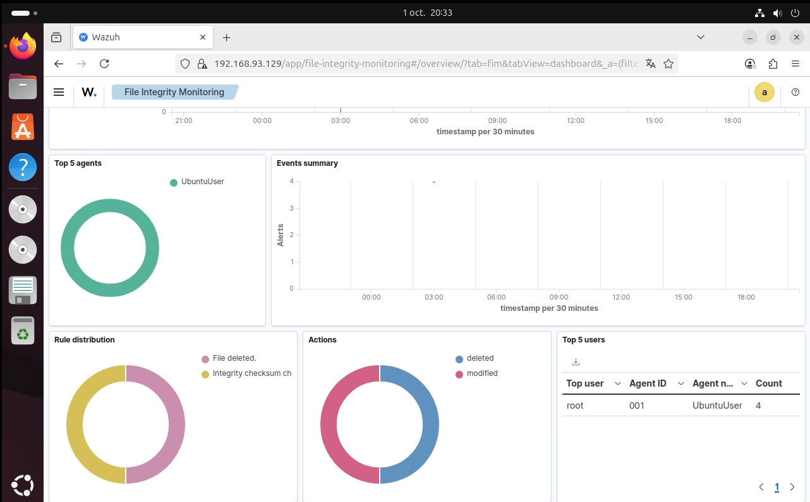

# Mini-lab SIEM avec Wazuh

## 🎯 Objectif
Mettre en place un mini-SIEM avec **Wazuh** sur une VM Ubuntu, connecter un agent et simuler des attaques pour observer la détection dans l’interface.

---

## 1) Prérequis

- **VMware Workstation**
- 2 machines virtuelles Ubuntu 22.04 :
  - **VM principale (Manager + Agent)**
    - Ressources : 2 vCPU, 8 GB RAM, 20–50 GB disque
    - Réseau : NAT
  - **VM clone (attaquant)**
    - Même configuration que la principale
- Connexion internet pour télécharger les paquets



---

## 2) Installation du serveur Wazuh (manager + dashboard + agent intégré)

Sur la **VM principale** (Ubuntu), exécuter la commande officielle d’installation tout-en-un :

```bash
curl -sO https://packages.wazuh.com/4.13/wazuh-install.sh
sudo bash ./wazuh-install.sh -a
```

Vérifier l’état du manager et de l’agent locaux :
```bash
sudo systemctl status wazuh-manager
sudo systemctl status wazuh-agent
```

---

## 3) Installation et connexion d’un agent

### 3.1 Sur la VM principale (auto-agent déjà installé)
L’installation précédente installe déjà un agent local.  
Il apparaît par défaut dans l’interface comme **UbuntuUser**.

### 3.2 Sur le clone (agent)

Depuis l’interface Wazuh (Manager UI), j’ai généré la commande d’installation de l’agent.  
J’ai ensuite exécuté cette commande directement sur la VM clone, ce qui a permis d’enregistrer l’agent automatiquement auprès du manager.



---

## 4) Tests d’attaques simulées

### 4.1 Brute force SSH

Depuis la **VM clone** vers la **VM principale** :

```bash
ssh user@192.168.93.129
# Entrer un mot de passe faux plusieurs fois
```

Dans Wazuh, une alerte apparaît dans :



### 4.2 Simulation d’attaque 2 – Création de fichier suspect

J’ai créé un fichier suspect pour tester la détection de modifications système :
```bash
echo "This is a test malware file" > malware_test.txt
sudo touch /usr/bin/test_malware
```
Wazuh détecte la création de fichiers potentiellement malveillants.
Ces événements apparaissent également en Medium Severity.



---

## 5) Conclusion

Ce mini-lab montre comment :
- Installer et configurer un manager et un agent Wazuh.
- Simuler deux attaques simples (SSH brute force et création de fichiers suspects).
- Vérifier que Wazuh détecte les événements et génère des alertes.
